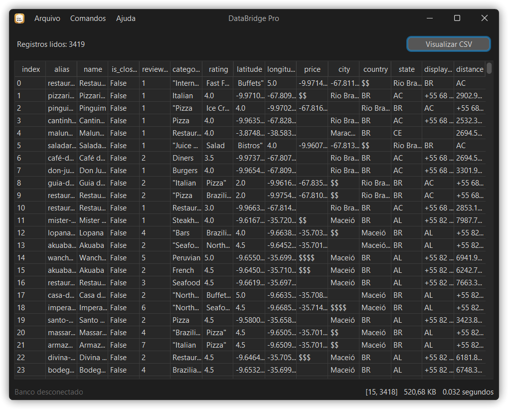
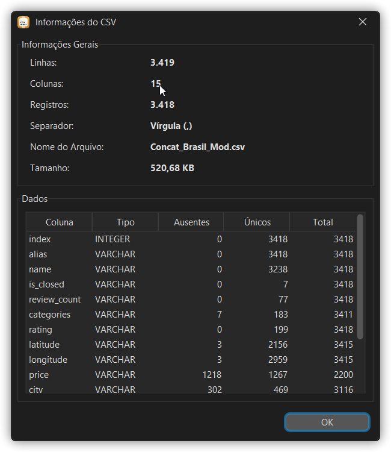

# DataBridge Pro
O DataBridge Pro é um projeto acadêmico em Java, projetado para ler arquivos CSV com diferentes delimitadores (vírgula, ponto-e-vírgula e tabulação). O aplicativo também permite a conexão com bancos de dados PostgreSQL para uma transferência de dados eficiente.

<!-- Use  element to set a maximum width. -->

## Funcionalidades
1. Leitura de Arquivos CSV: suporta múltiplos delimitadores, facilitando a importação de dados de diversos formatos.
2. Conexão com Bancos de Dados PostgreSQL: estabelece conexões seguras e permite a transferência direta de dados do arquivo CSV para bancos de dados PostgreSQL.
3. Processo de Envio de Dados: Utiliza transações SQL para garantir a integridade dos dados durante a transferência, realizando verificações de validação e tratamento de erros para garantir uma operação confiável.

## Guia de Utilização
1. Importe o arquivo CSV local (`Arquivo > Abrir arquivo local`) ou importe direto de um URL (`Arquivo > Abrir arquivo da Web`);
2. Configure as informações de conexão do banco de dados PostgreSQL na janela de configuração `Comandos > Conectar Banco de Dados`;
3. Use o assistente de importação em `Comandos > Enviar arquivo para banco de dados` para configurar os dados e enviá-los para o banco de dados;

É possível visualizar informações do arquivo CSV, como número de linhas, colunas, dados ausentes, entre outras, por meio do menu `Comandos > Informações do CSV`. Também é possível realizar consultas básicas nos dados que já foram enviados para o banco de dados conectado através do assistente em `Comandos > Filtrar dados`.

## Limitações e Futuras Melhorias
- Ainda não permite edição dos dados do arquivo CSV;
- Funciona somente com bancos de dados PostgreSQL;
- Para um grande volume de dados, o upload pode ser demorado;

## Requerimentos
Requer o JDK 21 ou superior para ser executado no Windows, Linux ou macOS.

## Agradecimentos
Desenvolvido em parceria com [Brandon Saraiva](https://github.com/BrandonSaraiva).
